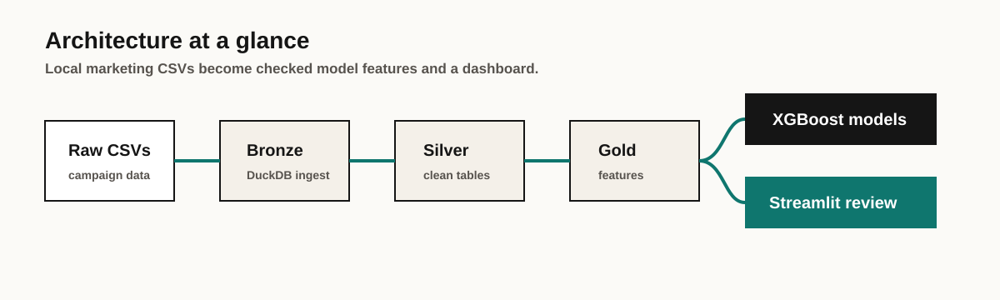
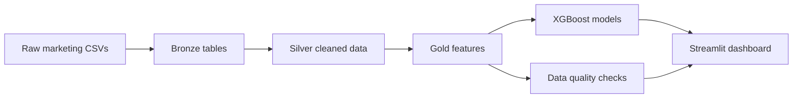

# Marketing ML Lakehouse

<div align="center">

### DuckDB lakehouse, ML training pipeline, and Streamlit dashboard


[](https://github.com/MatthewPaver/marketing-ml-lakehouse/actions/workflows/validate.yml)

</div>

---


## Portfolio Quick Read

| Section | Where to look |
|:---|:---|
| What it solves | Turns raw marketing CSVs into a repeatable local analytics and ML workflow |
| Quick start | [`make install`](#canonical-setup), [`make run`](#run-the-pipeline), [`make dashboard`](#run-the-dashboard) |
| Screenshot | [Portfolio Store](https://matthewpaver.github.io/MatthewPaver/store/) |
| Architecture | [System Shape](#system-shape) |
| Tests | `make test` rebuilds the local lakehouse and runs validation |
| Tech stack | `Python` `DuckDB` `pandas` `XGBoost` `Streamlit` |

## Status

`Runnable application`

This repository contains a local-first marketing analytics stack built around:

- a DuckDB bronze → silver → gold pipeline
- ML training for performance and pacing
- a Streamlit dashboard for exploration and presentation

## Reviewer Pack

| Area | Details |
|:---|:---|
| What it solves | Raw campaign CSVs become an inspectable bronze, silver, and gold lakehouse with model training and dashboard review. |
| Screenshot | [Portfolio Store preview](https://matthewpaver.github.io/MatthewPaver/store/preview.html?app=lakehouse) |
| Run locally | `make install && make run` |
| Dashboard | `make dashboard` then open `http://localhost:8501` |
| Tests | `make test` rebuilds DuckDB/models from demo data, then runs pytest |
| Demo data | Included under `marketing-ml/data/raw/` |
| Architecture | Raw CSVs -> DuckDB bronze/silver/gold -> XGBoost models -> data-quality checks -> Streamlit dashboard |
| Limitations | Local-first demonstration with sample marketing data; not connected to a live ad-platform API. |

## Reviewer Notes

- **Reproducible path:** root `Makefile` and `requirements.txt` are the canonical entry points.
- **Data engineering signal:** bronze, silver, and gold layers make the pipeline auditable rather than a one-off notebook.
- **ML signal:** model training sits after feature construction, with dashboard consumption separated from pipeline execution.
- **Verification path:** run `make test` after setup; it rebuilds the local DuckDB/models from demo data before running pytest. Use `make run` and `make dashboard` for the full local flow.

## System Shape





The project is designed to show a full local analytics workflow: ingestion, transformation, feature building, model training, quality checks, and dashboard consumption.

## Canonical Entry Point

The active implementation lives under [`lakehouse/`](lakehouse).

The older [`marketing-ml/`](marketing-ml) subtree is retained as a legacy reference, but the root README, root `requirements.txt`, and root Makefile now point to the current `lakehouse/` flow.

## Canonical Setup

```bash
python -m venv .venv
source .venv/bin/activate
python -m pip install --upgrade pip
python -m pip install -r requirements.txt
```

Or use the Makefile:

```bash
make install
```

## Run The Pipeline

```bash
python -m lakehouse.run_all
```

Or:

```bash
make run
```

## Run The Dashboard

```bash
streamlit run lakehouse/dashboard/app.py
```

Or:

```bash
make dashboard
```

The dashboard is served at `http://localhost:8501`.

## Data Expectations

The current pipeline reads raw inputs from `marketing-ml/data/raw/`:

- `audience_segments.csv`
- `budget_pacing.csv`
- `conversion_events.csv`
- `meta_campaign_performance.csv`

## Repository Layout

```text
lakehouse/      active pipeline, models, and dashboard
marketing-ml/   older reference implementation
requirements.txt
Makefile
```

## Notes

- Root `requirements.txt` is canonical.
- `lakehouse/requirements.txt` and `marketing-ml/requirements.txt` are compatibility shims.
- If you land inside the subdirectories directly, prefer coming back to the repository root for setup.

## License

MIT. See [`LICENSE`](LICENSE).
