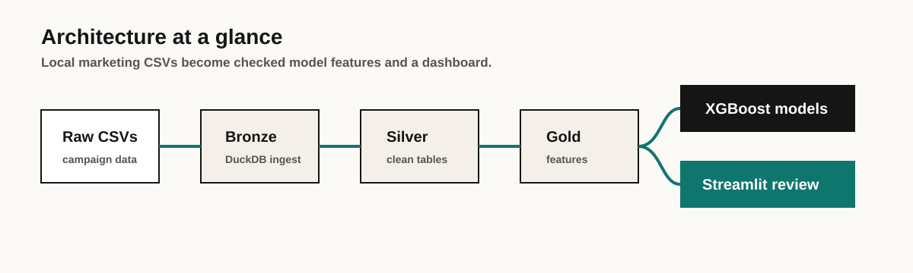
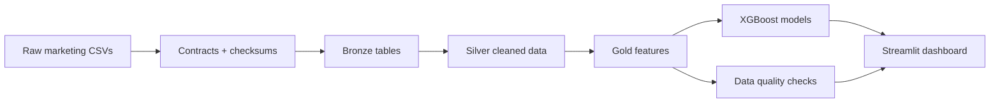

# Marketing ML Lakehouse

Turn campaign files into checked data tables, then test whether a model predicts tomorrow's bookings better than simply using today's figure.

This is a reusable data engineering and ML template. A marketing analyst can inspect the data-quality findings and forecasts; an engineer can rebuild the pipeline and adapt its contracts to another source. The included data is a demonstration fixture, not evidence of commercial campaign performance.

<div align="center">

### DuckDB lakehouse, ML training pipeline, and Streamlit dashboard


[](https://github.com/MatthewPaver/marketing-ml-lakehouse/actions/workflows/validate.yml)

</div>

---


**[Open the no-setup evidence console](https://matthewpaver.github.io/marketing-ml-lakehouse/)** — a browser review of the campaign, pacing, quality, lineage and model-holdout evidence, read from `docs/generated/evidence.json`. GitHub Pages is rebuilt by [`.github/workflows/pages.yml`](.github/workflows/pages.yml) on every push to `main`, after the pipeline and tests pass. The Python engine remains the canonical way to rebuild the lakehouse and models.

## Portfolio Quick Read

| Section | Where to look |
|:---|:---|
| What it solves | Turns contract-checked marketing data into a repeatable local analytics and ML workflow |
| Quick start | [`DEMO.md`](DEMO.md) · [`make install`](#canonical-setup), [`make run`](#run-the-pipeline), [`make dashboard`](#run-the-dashboard) |
| Reuse it | [`TEMPLATE.md`](TEMPLATE.md) · [optional public-data exercise](docs/PUBLIC_DATASET_PROFILE.md) |
| Case study | [Portfolio explanation and limits](https://matthewpaver.github.io/preview.html?app=lakehouse) |
| Architecture | [System Shape](#system-shape) |
| Tests | `make test` rebuilds the local lakehouse and runs validation |
| Tech stack | `Python` `DuckDB` `pandas` `XGBoost` `Streamlit` |

## What to do with it

1. **Inspect the example:** open the browser evidence console. Review campaign summaries, data-quality checks and source lineage without installing anything.
2. **Rebuild the result:** run `make install`, then `make run`. The pipeline validates the source files, builds raw, cleaned and analysis-ready DuckDB tables, and trains the next-day models.
3. **Challenge the prediction:** compare the model with the persistence baseline on later dates. A model score is useful only in relation to that baseline and the data available at prediction time.
4. **Reuse the pattern:** follow [`TEMPLATE.md`](TEMPLATE.md), or try the optional Google GA4 public-data adapter. Replace the source contract and target deliberately, rather than treating the fixture as your own campaign data.

This does not connect to an advertising account, change a budget or establish business impact. The public browser console displays committed evidence; the local Python pipeline is the route for rebuilding it.

## Reviewer Notes

- **Reproducible path:** root `Makefile` and `requirements.txt` are the canonical entry points.
- **Data engineering signal:** input contracts plus bronze, silver, and gold layers make the pipeline auditable rather than a one-off notebook.
- **ML signal:** both models make an explicit next-calendar-day prediction from end-of-day information, use whole-date holdouts, and report a persistence baseline. This prevents the former same-day target leakage.
- **Agent signal:** `lakehouse/agents.py` adds deterministic data-quality, feature-drift, campaign-insight, and model-risk reviewers around the pipeline.
- **Verification path:** run `make test` after setup; it rebuilds the local DuckDB/models from demo data before running pytest. Use `make run` and `make dashboard` for the full local flow.

## System Shape




```mermaid
flowchart LR
    A["Raw marketing CSVs"] --> H["Contracts + checksums"]
    H --> B["Bronze tables"]
    B --> C["Silver cleaned data"]
    C --> D["Gold features"]
    D --> E["XGBoost models"]
    D --> F["Data quality checks"]
    E --> G["Streamlit dashboard"]
    F --> G
```

The project is designed to show a full local analytics workflow: ingestion, transformation, feature building, model training, quality checks, and dashboard consumption.

## Canonical Entry Point

The implementation lives under [`lakehouse/`](lakehouse), with demo inputs in
[`data/raw/`](data/raw) and active tests in [`tests/`](tests).

## Canonical Setup

```bash
python3.11 -m venv .venv
source .venv/bin/activate
python -m pip install --upgrade pip
python -m pip install -r requirements.txt
```

Or use the Makefile:

```bash
make install
```

## Run The Pipeline

```bash
python -m lakehouse.run_all
```

Or:

```bash
make run
```

## Run The Dashboard

```bash
streamlit run lakehouse/dashboard/app.py
```

Or:

```bash
make dashboard
```

The dashboard is served at `http://localhost:8501`.

## Data Expectations

The current pipeline reads raw inputs from `data/raw/`:

- `audience_segments.csv`
- `budget_pacing.csv`
- `conversion_events.csv`
- `meta_campaign_performance.csv`

The versioned expectations live in [`contracts/raw_sources.json`](contracts/raw_sources.json). Run `make contract` to validate the committed inputs without rebuilding the lakehouse. The optional [GA4 public-data profile](docs/PUBLIC_DATASET_PROFILE.md) includes a bounded BigQuery query and a local adapter for a leakage-safe next-day purchase task; cloud access is explicit rather than a hidden runtime requirement.

## What the models are trying to solve

At the end of a campaign day, a marketing operator needs to decide what to inspect before the next day begins. The two reference models therefore predict (a) next-day bookings and (b) next-day under-pacing risk. Their value is measured against simple persistence baselines, not against an in-sample chart. The committed CSVs are synthetic fixtures, so results prove pipeline and evaluation behaviour only; they are not evidence about a real campaign.

**Limits of the committed evaluation.** The walk-forward holdout is 24 ad-set-days (4 dates × 6 ad sets, trained on 96). On that holdout the bookings model's MAE is 0.52 with a 95% bootstrap interval of [0.33, 0.73]; the prior-day persistence baseline is 0.67 [0.42, 0.92]. The intervals overlap, so the point "skill" of about 21% is not distinguishable from noise: **the fixture does not demonstrate skill over the prior-day baseline.** The under-pacing classifier is in the same position (accuracy intervals [0.79, 1.00] vs [0.71, 1.00]). Showing real skill would need a much longer history (hundreds of holdout days, ideally several walk-forward folds), a paired test on the per-row error difference rather than separate intervals, and real rather than synthetic data — for example the optional [GA4 public-data profile](docs/PUBLIC_DATASET_PROFILE.md). The figures above come from [`docs/generated/evidence.json`](docs/generated/evidence.json), which the console also reads.

## Repository Layout

```text
lakehouse/      active pipeline, models, and dashboard
contracts/      versioned raw-source expectations
data/raw/       small reproducible demo inputs
tests/          active pipeline and reviewer tests
TEMPLATE.md     guide for adapting the pattern to another domain
requirements.txt
Makefile
```

## Notes

- Root `requirements.txt` is canonical.
- `lakehouse/requirements.txt` is a compatibility shim for the root dependency list.
- `make contract` is the fastest check when changing input files or schemas.
- If you land inside the subdirectories directly, prefer coming back to the repository root for setup.

## Docker Compose

Run the complete pipeline in a disposable container:

```bash
make compose-pipeline
```

Or rebuild the pipeline and start the dashboard on
`http://localhost:8501`:

```bash
make compose-dashboard
```

## License

MIT. See [`LICENSE`](LICENSE).
