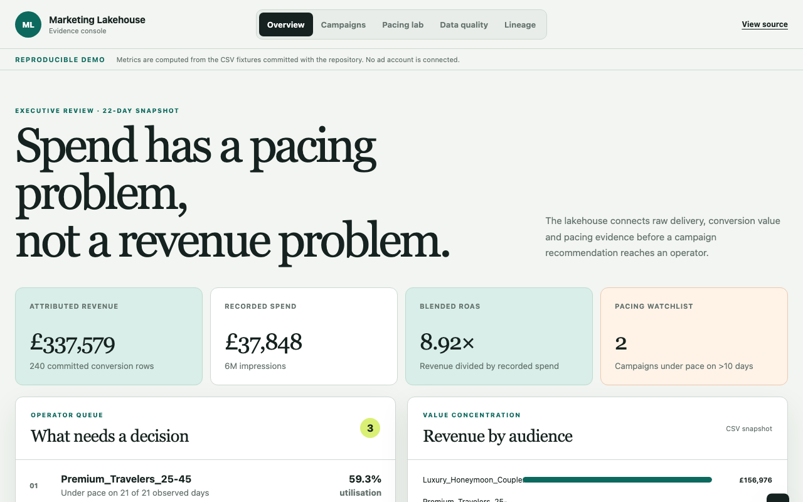
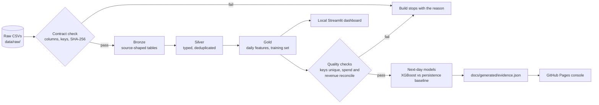

# Marketing ML Lakehouse: checked campaign data, honest next-day forecasts

For analysts and data engineers who need campaign files turned into trustworthy tables: it checks the raw files against a contract, builds bronze, silver and gold DuckDB tables, and tests whether a model predicts tomorrow's bookings better than simply reusing today's figure.

[](https://github.com/MatthewPaver/marketing-ml-lakehouse/actions/workflows/validate.yml)
[](LICENSE)



**Live evidence console (no install):** <https://matthewpaver.github.io/marketing-ml-lakehouse/>. CI rebuilds it from the pipeline output on every push to `main`, after the tests pass.

**Headline result:** on the committed fixture the bookings model does **not** beat the prior-day baseline by more than noise. MAE 0.52 [0.33, 0.73] against 0.67 [0.42, 0.92] on a 24-row holdout. The repository reports that rather than hiding it; see [Results](#results).

The included data is a synthetic demonstration fixture (August 2024, six ad sets). It shows that the pipeline and the evaluation behave correctly. It says nothing about the performance of a real campaign.

## The problem

At the end of a campaign day an operator has to decide what to look at before tomorrow: which ad sets are under-pacing, whether the numbers reconcile, and whether any forecast is worth trusting. Analytics demos usually stop at a chart built on files nobody has checked, and a model scored on rows from the same days it trained on.

This template makes three things explicit:

1. **Is the input what we expected?** Every raw file is checked against a versioned contract (columns, non-null fields, natural keys, SHA-256) before anything is loaded.
2. **Do the numbers reconcile?** Gold-layer spend and conversion revenue must match the sources, and daily keys must be unique, or the build stops.
3. **Does the model beat doing nothing clever?** Both models predict the next calendar day from end-of-day information and are scored against a persistence baseline on later, unseen dates, with bootstrap intervals.

## Quickstart

Python 3.11 (tested). No ad account, API keys or network access are needed after install.

```bash
git clone https://github.com/MatthewPaver/marketing-ml-lakehouse.git && cd marketing-ml-lakehouse
make install      # creates .venv with python3.11 and installs requirements.txt
make test         # validates contracts, rebuilds every layer, trains both models, runs pytest
make dashboard    # local Streamlit dashboard at http://localhost:8501 (Ctrl+C to stop)
```

Expected tail of `make test`:

```text
[6/7] Training regression model (bookings) …
Regression complete. Metrics:
{'mae': 0.5249127596616745, 'mae_95pct_bootstrap': [0.3302381856987874, 0.7329582671324412], 'baseline_mae': 0.6666666666666666, ...}
[7/7] Training classification model (under-pacing) …
...
Publishing generated Pages evidence …
22 passed in …
```

`make contract` checks the input files using only the standard library, before any ML package is installed. Windows and no-Make commands are in [`DEMO.md`](DEMO.md). `make compose-pipeline` and `make compose-dashboard` run the same steps in Docker.

## How it works


```mermaid
flowchart LR
    A[("Raw CSVs<br/>data/raw/")] --> K{"Contract check<br/>columns, keys, SHA-256"}
    K -- fail --> X["Build stops with the reason"]
    K -- pass --> B["Bronze<br/>source-shaped tables"]
    B --> S["Silver<br/>typed, deduplicated"]
    S --> G["Gold<br/>daily features, training set"]
    G --> Q{"Quality checks<br/>keys unique, spend and<br/>revenue reconcile"}
    Q -- fail --> X
    Q -- pass --> M["Next-day models<br/>XGBoost vs persistence baseline"]
    M --> E["docs/generated/evidence.json"]
    E --> P["GitHub Pages console"]
    G --> D["Local Streamlit dashboard"]
```

| Path | Role |
| --- | --- |
| `contracts/raw_sources.json`, `lakehouse/contracts.py` | Versioned file contracts; standard-library validator that writes `contract_report.json` |
| `lakehouse/ingest/`, `lakehouse/transform/` | Raw → bronze → silver → gold in DuckDB (`lakehouse/lakehouse.duckdb`) |
| `lakehouse/quality/compute_dq.py` | Key-uniqueness and reconciliation checks; raises if any fail |
| `lakehouse/ml/` | Next-day bookings regressor and under-pacing classifier, whole-date holdout, bootstrap intervals, leakage guard |
| `lakehouse/agents.py` | Deterministic threshold checks (data quality, feature drift, campaign insight, model risk). They are rules, not LLM agents |
| `lakehouse/publish_pages.py`, `docs/` | Builds the evidence JSON and the static console that reads it |
| `lakehouse/public_data/ga4.py` | Optional adapter for Google's public GA4 sample ([profile](docs/PUBLIC_DATASET_PROFILE.md)) |

## Results

Reproduce with `make run` (or `python -m lakehouse.run_all`). The figures are written to `lakehouse/models/*.json` and [`docs/generated/evidence.json`](docs/generated/evidence.json), which the console also reads.

Walk-forward holdout: trained on 96 ad-set-days (1–16 August 2024), tested on the next 24 (17–20 August: 4 dates × 6 ad sets). Intervals are 95% percentile bootstrap over holdout rows (2,000 resamples, seed 42).

| Task | Model | Persistence baseline | Point difference | Shown to be better? |
| --- | --- | --- | --- | --- |
| Next-day bookings (MAE, lower is better) | 0.52 [0.33, 0.73] | 0.67 [0.42, 0.92] | 21% lower error | **No.** The intervals overlap |
| Next-day under-pacing (accuracy) | interval [0.79, 1.00] | interval [0.71, 1.00] | balanced accuracy 0.91 vs 0.87 | **No.** The intervals overlap |

Quality checks on the same build: 3 of 3 pass (daily key unique, spend reconciles, conversion revenue reconciles).

What this does not show:

- **Skill.** 24 holdout rows over four dates cannot separate the model from "tomorrow looks like today". Showing real skill would need hundreds of holdout days, several walk-forward folds, a paired test on the per-row error difference rather than two separate intervals, and real data. The optional [GA4 public-data profile](docs/PUBLIC_DATASET_PROFILE.md) is the route to a more realistic source.
- **Campaign performance.** ROAS and revenue on the console are arithmetic on synthetic rows. They are not evidence about any advertiser.

## Design decisions and trade-offs

- **DuckDB on a laptop over Spark, Delta or a cloud warehouse.** The whole lakehouse rebuilds from committed CSVs in CI with no credentials, so every number in this README is reproducible. Cost: no partitioning, incremental merge or concurrent writers. [`TEMPLATE.md`](TEMPLATE.md) lists what a production version still needs.
- **Contracts checked before ingestion, in the standard library, over validating after load in pandas.** A bad file fails with its name and reason before any table is touched, and `make contract` runs before the ML dependencies are installed. Cost: the contract is structural (columns, non-null fields, keys). It does not catch a plausible but wrong value.
- **Whole-date walk-forward holdout and a persistence baseline over a random row split.** A random split puts rows from the same day in both training and test data, and an earlier version of this repository had same-day target leakage. `assert_prospective_features` now rejects any `target_` or `next_` column as a feature. Cost: with 20 dates of data the holdout is four days, so the intervals are wide.
- **The console reads generated evidence over hand-written numbers.** Pages deploys only after `make test` passes, and the browser renders `evidence.json` from that run, so the public figures cannot drift from the pipeline. Cost: the console is a snapshot of the fixture, not a view of your local rebuild.
- **Deterministic rule checks over LLM commentary.** The reviewers in `agents.py` are threshold functions with unit tests, so the same input always gives the same verdict. The Streamlit dashboard can call an OpenAI-compatible endpoint for chart summaries, but only when `LLM_ENDPOINT` is set, and otherwise falls back to a rule-based sentence. Cost: the rules only catch what their thresholds encode.

## Limits and non-goals

- The committed data is synthetic: 6 ad sets over about three weeks. Results prove that the pipeline and the evaluation behave correctly, nothing more.
- It does not connect to an ad platform, change a budget or estimate incrementality. The console's attribution is a mixed 7-day-click / 1-day-view window taken from the fixture.
- The console's overview headline and its "pacing lab" budget-move estimate (observed ROAS cut by 30%) are illustrations on the fixture, not recommendations.
- Single-process DuckDB. No orchestration, retries, backfill, access control or model registry.
- Dependencies are version ranges in `requirements.txt`, not a lockfile.

## Repository layout and tests

```text
lakehouse/          pipeline package: contracts, ingest, transform, quality, ml, agents, dashboard
contracts/          versioned raw-source contract
data/raw/           four committed CSV fixtures
docs/               Pages console (index.html, app.js), generated evidence, GA4 profile notes
public_data/ga4/    BigQuery export query for the optional GA4 profile
tests/              pytest suite, Pages contract test (Node), Playwright console script
TEMPLATE.md         how to adapt the pattern to another domain
DEMO.md             step-by-step run, Windows commands, where outputs land
Makefile            install, contract, run, test, dashboard, Docker targets
```

`make test` rebuilds everything and runs `pytest tests -q` (22 tests). CI runs it on every push and pull request ([`validate.yml`](.github/workflows/validate.yml)), and the Pages workflow runs it again before deploying. `node --test tests/pages_contract.test.mjs` checks the console's evidence contract; it is not yet part of CI. `lakehouse/requirements.txt` only points back at the root `requirements.txt`.

## Licence

MIT. See [LICENSE](LICENSE).
