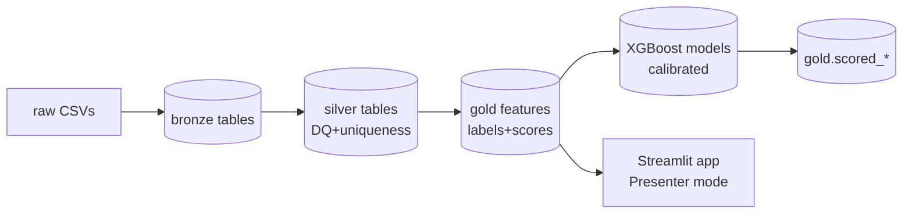

# marketing-ml-lakehouse (local lakehouse demo)

Local, offline lakehouse mirroring Databricks layers (bronze→silver→gold) with DuckDB, Pandas ETL, XGBoost, and a Streamlit app. Optional LM Studio provides “Next steps” actions.

## Project layout
```
marketing-ml/
  data/{raw,bronze,silver,gold}/
  scripts/
  utils/
  app/
  lakehouse.duckdb (created by scripts)
```

Place CSVs in `data/raw/`:
- meta_campaign_performance.csv
- budget_pacing.csv
- conversion_events.csv
- audience_segments.csv

## Run (local)
```bash
python -m venv .venv && source .venv/bin/activate
pip install -r requirements.txt
python scripts/run_all.py
streamlit run app/dashboard.py
```

## Docker
```bash
cd marketing-ml
# build image in this folder
docker build -t marketing-ml -f Dockerfile .
# run pipeline inside container (writes lakehouse.duckdb in /app)
docker run --rm -v "$(pwd)":/app marketing-ml bash -lc "python scripts/run_all.py"
# run app (http://localhost:8501)
docker run --rm -p 8501:8501 -v "$(pwd)":/app marketing-ml
```

## LM Studio (optional)
- Start server at `http://localhost:1234` (or your LAN host) and set `LM_ENDPOINT`/`LM_MODEL`.
- Sidebar shows status and three concise action bullets (grounded in current filters). Caption: “AI summary generated locally”.

## Architecture (Mermaid)


## Quality gates
- Deterministic outputs; no forward leakage
- Time-aware validation (train ≤ T, validate > T)
- Charts with targets/bands and So‑what context
- “Next steps” grounded in on‑screen numbers
- Fully runnable offline (local CSVs, DuckDB, LM Studio)

## Notes
- Revenue derived from booking_completed events → `silver.revenue_by_day` → `gold.training_dataset` (`revenue`, `roas`).
- Probabilities calibrated (isotonic). Feature importances included for both models.
- Footer in app: “Generated locally with DuckDB + LM Studio | v1.0”.
